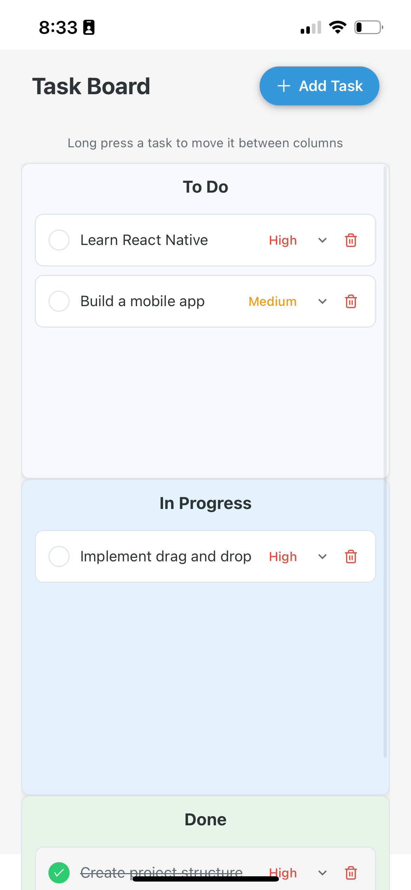
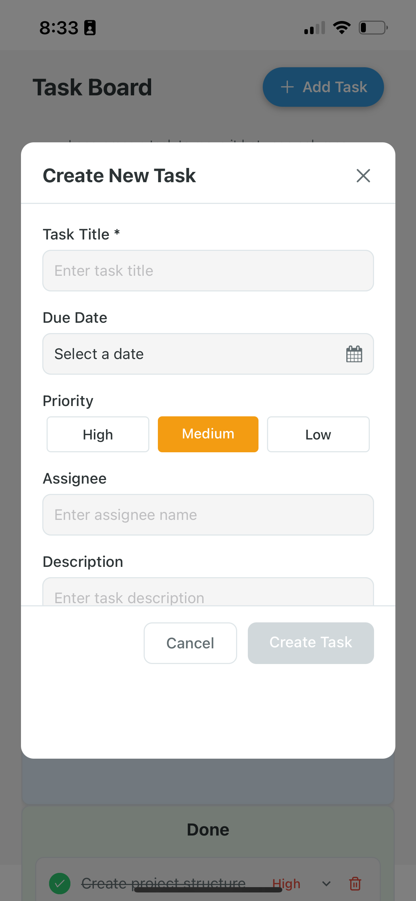
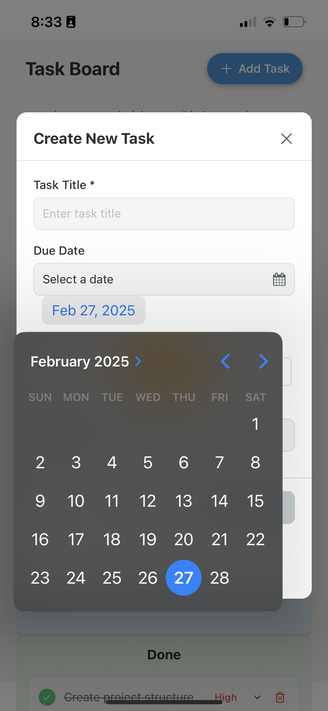
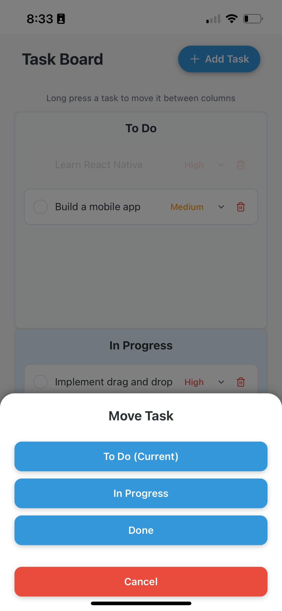

# Kanban Board App

A React Native drag-and-drop Kanban board app built with Expo, allowing users to manage tasks across different columns with rich metadata.

## Features

- Configurable task columns (To Do, In Progress, Done)
- Drag and drop tasks between columns
- Task creation with comprehensive metadata (title, description, due date, priority, assignee)
- Task detail view with expandable cards
- Responsive design that adapts to both landscape and portrait orientations
- Performance optimized for handling large numbers of tasks

## Screenshots

## Installation

### Prerequisites

- Node.js (v14 or newer) 
- npm or yarn
- Expo CLI

### Setup

1. Clone the repository:

git clone https://github.com/tiborthompson/kanban-board-app.git
cd kanban-board-app 

2. Install dependencies:

npm install

3. Start the App: 

npx expo start -c 

# or us a simulator